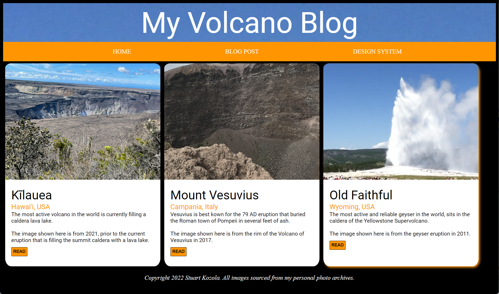
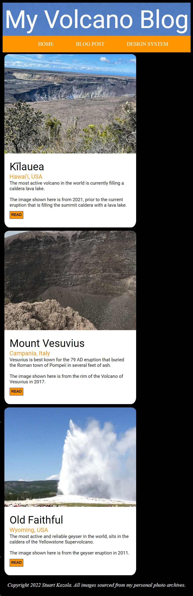
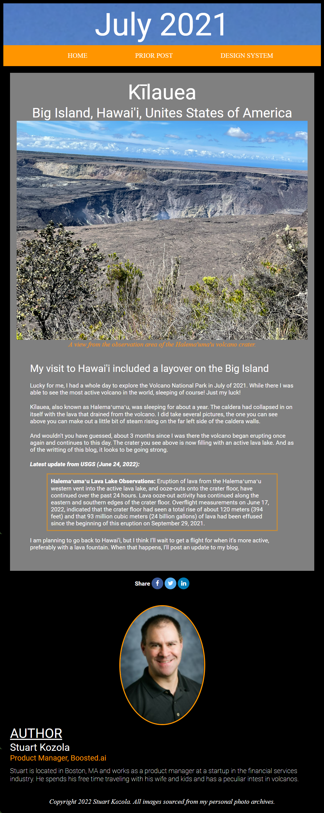

# Project 1: Personal Blog Website
## Udacity Front End Developer Nanodegree Program
A personal website built from scratch using HTML and CSS only.  This site is an example of a personal blog website that is repsonsive to screen resolution (breakpoint is 900 pixels)

### Live Webpages
- [Design System](https://stukozola.github.io/Udacity-FrontEnd-Blog-Project/design-system.html)
- [Homepage](https://stukozola.github.io/Udacity-FrontEnd-Blog-Project/)
- [Blog page](https://stukozola.github.io/Udacity-FrontEnd-Blog-Project/blogs/latest.html)

## Example Sreenshots

#### Desktop Views

#### Mobile Views

### References 
1. Images - All images on the site came from my personal photo archive
2. Social media buttons - Social media icons are from [font-awsome](https://fontawesome.com/icons) and CSS formating guidance from [w3schools](https://www.w3schools.com/howto/howto_css_social_media_buttons.asp)